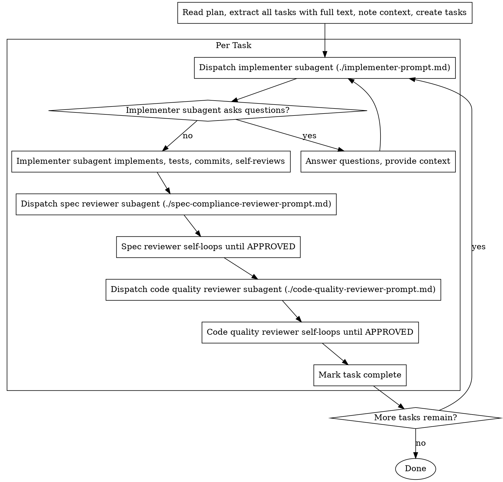

# Subagent-Driven Execution

Execute plan by dispatching fresh subagent per task, with two-stage review after each. Each reviewer self-loops: it reviews, fixes issues directly, and re-reviews until passing.

**Why subagents:** You delegate tasks to specialized agents with isolated context. By precisely crafting their instructions and context, you ensure they stay focused and succeed at their task. They should never inherit your session's context or history — you construct exactly what they need. This also preserves your own context for coordination work.

**Available Tools:** Read `${PWD}/docs/TOOLS.md` for available MCP tools. When dispatching subagents, ensure each subagent prompt includes the TOOLS.md reference with the appropriate phases for its role (see phase assignments in each prompt template).

**Core principle:** Fresh subagent per task + self-looping reviewers = high quality, minimal orchestration overhead

## The Process



## Model Selection

Use the least powerful model that can handle each role to conserve cost and increase speed.

**Mechanical implementation tasks** (isolated functions, clear specs, 1-2 files): use a fast, cheap model. Most implementation tasks are mechanical when the plan is well-specified.

**Integration and judgment tasks** (multi-file coordination, pattern matching, debugging): use a standard model.

**Architecture, design, and review tasks**: use the most capable available model.

**Task complexity signals:**
- Touches 1-2 files with a complete spec → cheap model
- Touches multiple files with integration concerns → standard model
- Requires design judgment or broad codebase understanding → most capable model

## Handling Implementer Status

Implementer subagents report one of four statuses. Handle each appropriately:

**DONE:** Proceed to spec compliance review.

**DONE_WITH_CONCERNS:** The implementer completed the work but flagged doubts. Read the concerns before proceeding. If the concerns are about correctness or scope, address them before review. If they're observations (e.g., "this file is getting large"), note them and proceed to review.

**NEEDS_CONTEXT:** The implementer needs information that wasn't provided. Provide the missing context and re-dispatch.

**BLOCKED:** The implementer cannot complete the task. Assess the blocker:
1. If it's a context problem, provide more context and re-dispatch with the same model
2. If the task requires more reasoning, re-dispatch with a more capable model
3. If the task is too large, break it into smaller pieces
4. If the plan itself is wrong, escalate to the human

**Never** ignore an escalation or force the same model to retry without changes. If the implementer said it's stuck, something needs to change.

## Prompt Templates

Each prompt file has a yaml frontmatter with `agent.subagent_type` and `agent.description`. Read the file, fill in the placeholders, and pass the content below `---` as the prompt to the **Agent tool**.

- `./implementer-prompt.md` — Agent tool (`subagent_type: "general-purpose"`)
- `./spec-compliance-reviewer-prompt.md` — Agent tool (`subagent_type: "general-purpose"`) — self-loops until APPROVED
- `./code-quality-reviewer-prompt.md` — Agent tool (`subagent_type: "general-purpose"`) — self-loops until APPROVED

Reviewers handle their own fix→re-review loop internally. You (the orchestrator) just dispatch them and wait for their final status. Do not manage re-review iterations yourself.

## Example Workflow

```
[Read plan file once: docs/superpowers/plans/feature-plan.md]
[Extract all 5 tasks with full text and context]

Task 1: Hook installation script

[Dispatch implementation subagent with full task text + context]

Implementer: "Before I begin - should the hook be installed at user or system level?"
You: "User level (~/.config/superpowers/hooks/)"
Implementer: DONE
  - Implemented install-hook command
  - Added tests, 5/5 passing
  - Committed

[Dispatch spec compliance reviewer — it self-loops internally]
Spec reviewer: APPROVED (1 iteration)

[Dispatch code quality reviewer — it self-loops internally]
Code quality reviewer: APPROVED (1 iteration)

[Mark Task 1 complete]

Task 2: Recovery modes

[Dispatch implementation subagent with full task text + context]
Implementer: DONE
  - Added verify/repair modes
  - 8/8 tests passing
  - Committed

[Dispatch spec compliance reviewer]
Spec reviewer: APPROVED (2 iterations)
  - Iteration 1: missing progress reporting, extra --json flag → fixed both
  - Iteration 2: all requirements met

[Dispatch code quality reviewer]
Code quality reviewer: APPROVED (2 iterations)
  - Iteration 1: magic number (100) → extracted PROGRESS_INTERVAL constant
  - Iteration 2: approved

[Mark Task 2 complete]

...

Done!
```

## Red Flags

**Never:**
- Start implementation on main/master branch without explicit user consent
- Skip reviews (spec compliance OR code quality)
- Dispatch multiple implementation subagents in parallel (conflicts)
- Make subagent read plan file (provide full text instead)
- Skip scene-setting context (subagent needs to understand where task fits)
- Ignore subagent questions (answer before letting them proceed)
- **Start code quality review before spec compliance is APPROVED** (wrong order)
- Move to next task while either review is not APPROVED
- Manage reviewer fix→re-review loops yourself (reviewers self-loop)

**If subagent asks questions:**
- Answer clearly and completely
- Provide additional context if needed
- Don't rush them into implementation

**If subagent fails task:**
- Dispatch fix subagent with specific instructions
- Don't try to fix manually (context pollution)